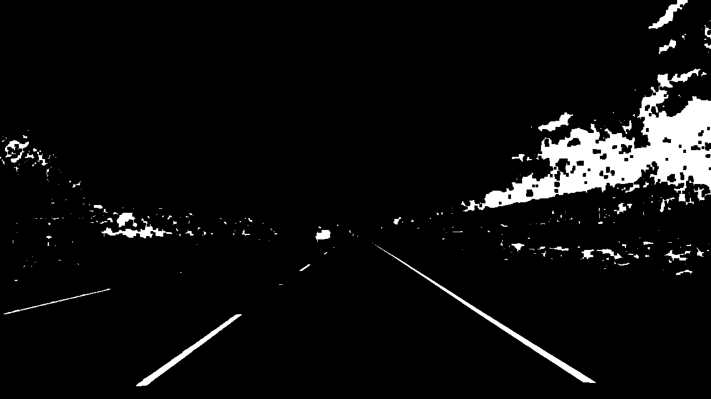

# Advanced Lane Finding

In this project, the goal is to write a software pipeline to identify the lane boundaries in a video.  

The youtube link with a result is provided here:
https://youtu.be/s-wlc-a5e60

## The Project
---

The goals / steps of this project are the following:

* Compute the camera calibration matrix and distortion coefficients given a set of chessboard images.
* Apply a distortion correction to raw images.
* Use color transforms, gradients, etc., to create a thresholded binary image.
* Apply a perspective transform to rectify binary image ("birds-eye view").
* Detect lane pixels and fit to find the lane boundary.
* Determine the curvature of the lane and vehicle position with respect to center.
* Warp the detected lane boundaries back onto the original image.
* Output visual display of the lane boundaries and numerical estimation of lane curvature and vehicle position.

The images for camera calibration are stored in the folder called `camera_cal`.  The images in `test_images` are for testing your pipeline on single frames.  If you want to extract more test images from the videos, you can simply use an image writing method like `cv2.imwrite()`, i.e., you can read the video in frame by frame as usual, and for frames you want to save for later you can write to an image file.  

To help the reviewer examine your work, please save examples of the output from each stage of your pipeline in the folder called `ouput_images`, and include a description in your writeup for the project of what each image shows.    The video called `project_video.mp4` is the video your pipeline should work well on.  

The `challenge_video.mp4` video is an extra (and optional) challenge for you if you want to test your pipeline under somewhat trickier conditions.  The `harder_challenge.mp4` video is another optional challenge and is brutal!

If you're feeling ambitious (again, totally optional though), don't stop there!  We encourage you to go out and take video of your own, calibrate your camera and show us how you would implement this project from scratch!

## Rubric points

### Compute the camera calibration matrix and distortion coefficients given a set of chessboard images.

Any camera lens will have distortion problem. In order to fix distortion, following steps were done:

* Calibration images with chess metrix were loaded
* Chessboard corners were found
* Camera calibration were found with cv2.calibrateCamera function
* Each image (video frame) was calibrated

Original image             |  Calibrated image
:-------------------------:|:-------------------------:
   |  

Original image             |  Calibrated image
:-------------------------:|:-------------------------:
   |  

### Apply a distortion correction to raw images.

Distortion was applied to each image (video frame).

Original image             |  Calibrated image
:-------------------------:|:-------------------------:
   |  

### Use color transforms, gradients, etc., to create a thresholded binary image.

Color transform is key part of line detection. In the project I use a combination of S channel of HLS and L channel of LUV.

Original image             |  Gradient image
:-------------------------:|:-------------------------:
   |  
   |  

### Apply a perspective transform to rectify binary image ("birds-eye view").

The perspective transform was used by estimated parameters.

Original image             |  Birds-eye view image
:-------------------------:|:-------------------------:
   |  
   |  

### Detect lane pixels and fit to find the lane boundary.

Lane detection is shown on the following picture.

Detect rawly line             |  Draw line
:-------------------------:|:-------------------------:
   |  
   |  

### Determine the curvature of the lane and vehicle position with respect to center.

Curvature detection was done by these parameters:
* ym_per_pix = 30.48/100
*  xm_per_pix = 3.7/100

The radius of curvature is computed upon calling the DetectLines.detect() method. At the end of method curvature is 
calculated as polynomial f(y)=A y^2 +B y + C  and the radius of curvature is given by R = [(1+(2 Ay +B)^2 )^3/2]/|2A|.

The distance from the center of the lane is computed in DetectLines.detect() method, which measures the distance between center of an image and middle point of left and right line.

### Warp the detected lane boundaries back onto the original image.

Warped image is shown on the following picture.

### Output visual display of the lane boundaries and numerical estimation of lane curvature and vehicle position.

The youtube link with a result provided here:
https://youtu.be/s-wlc-a5e60

## Discussion

### What problems/issues did you face in your implementation of this project?
I had a trouble with coding in python, specificly numpy arrays as I did not know what numpy functions makes with arrays.

### Where will your pipeline likely fail? 
* Low lights and large lane shadows
* Bumbing road

### What could you do to make it more robust?
I see three crutial steps to improve in Lane detection
* Use color transforms, gradients - this step can be very much improved by using various filters in different lighting scenarios
* Detect lane pixels - detection of "right" pixels is very crutial as time to time "obstacles" are detected as part of line
* Lane smoothing and filtering  - averaging lines in a time, removing "wrong" lines can rapidly improve lane detection

